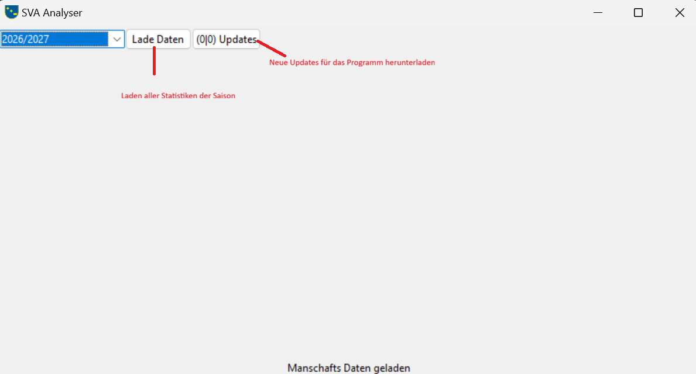

# SvaAnalyser
Der SV Analyzer ist dazu da, um die Datebank auszulesen und eine Stastik zu berechnen.

# How to use
- Starte `run.bat`. Es wird sich ein Fenster öffnen:

Eine Bash console wird im Hintergrund laufen. Bitte nicht schließen, sonst schließt sich die GUI auch.
- Wähle eine Saison aus und drücke `Lade Daten`.
- Die geladenen Daten werden als Tabellenform dargestellt. Hier kannst du die eizelnen Einträge überprüfen
- Um die Analyse durchzuführen drücke `Analysiere geladene Daten`
- Nun kannst du im `plots` Ordner die Graphen finden und im `excel` Ordner die Tabellen

# Installation
Zur Installation werden zwei Programme benötigt:
- Python: [Python Installer](https://www.python.org/downloads/)
   - Lade hier die neusten standalon Version herunter
   - Bei der Installtion musst du darauf achten, dass ganz am am Anfang der Haken bei `Add Python X.X to Path` gesetzt ist
   - Klicke den `Install Now` Button
   - Drücke weiter bis die Installetion fertig ist
- Git: [Git Installer](https://git-scm.com/install/)
Hist ist auf nichts weitres zu achten

Wenn die Programme installiert sind müssen folgende Schritte duchgeführt werden:
- Erstelle einen Ordner
- Öffne den Ordner und öffne Git Bash oder Comand Terminal (Rechte Maustaste > Weitere Optionen Anzeigen)
- Kopiere den text in die Zeile `git clone https://github.com/DevKartoffel/SvaAnalyser.git`
- Drücke Enter
- Wenn fertig, schließe das tool
- Im Ordner liegen nun Dateien. Führe die Datei `run.bat` aus.

Das Programm wird estwas brauchem, um alle Pakete zu erstellen und installieren. Am Ende sollte ich due GUI öffnen.

## Umgebung
Es gibt keine Passworteingabe in der GUI. Deshalb wird das über Umgebungsvariablen gemacht.
- Erstelle eine Datei mit dem namen `.env`
- Gebe deine Authentifizierungsdaten dort nach folgendem Muster ein:
```
EMAIL=your.email@gmail.com
PW=yOURpassWord
```